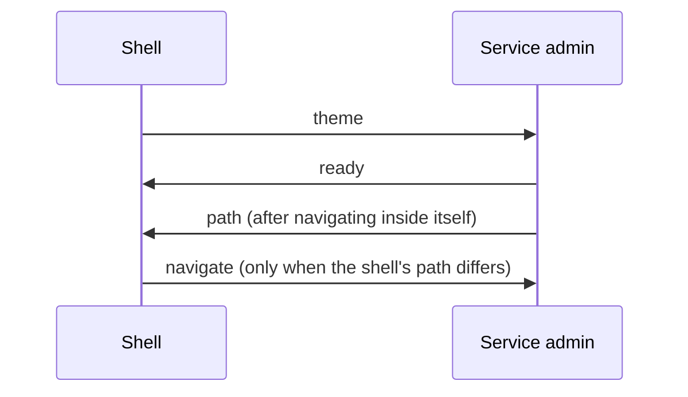

*[Documentation](README.md) → The admin panel*

# The admin panel

One panel at `/admin`, made of parts that belong to different services.

## What is in it

| Part | Belongs to | Holds |
| --- | --- | --- |
| **Auth** | the Auth service | sign-in addresses, their state, sessions, the security log |
| **Users** | the Users service | product profiles |
| **Notifications** | the Notifications service | the event log, read-only |
| **Email** | the Email service | templates, the editor, the delivery log |
| **Администраторы** | the panel itself | who may open it and what they may reach |
| **Журнал** | the panel itself | every change to administrator access |
| **База данных** | the panel itself | the database browser, owner-only |

The sidebar also links to the site and the application. They open in their own tab: they are the
product, not part of the panel.

## Two kinds of thing, and why the URLs say which

A **service admin** is one service's own window onto its own data, built and served by that service.
A **section** is the panel's own page.

Everything the panel embeds lives under `/admin/embed/`, and the panel's own pages are ordinary
paths:

| | |
| --- | --- |
| `/admin/` | the panel's own home, which opens nothing by itself |
| `/admin/service/email#/templates/123` | the panel's page, showing the Email admin |
| `/admin/embed/service/email/templates/123` | the Email admin itself, embedded |
| `/admin/database` | the panel's page, showing the database browser |
| `/admin/embed/database/` | the browser itself |
| `/admin/administrators`, `/admin/audit` | the panel's own sections |

An embedded URL can also be opened directly — Gateway performs the very same check either way.

## How the shell and an embedded admin talk

The shell owns the sidebar, the theme and the URL. The embedded admin owns everything inside its
frame. They exchange four messages, all same-origin:

The theme is sent more often than the diagram suggests — on every frame load, again when the frame
reports `ready`, and on every change of the choice. A frame starts out knowing nothing about it, and
its listener may not be attached yet when `load` fires, so the shell repeats itself instead of
assuming. The path is the opposite, and that is the rule that matters: **the shell never replays it.**
A load can be the frame's own navigation, and sending back the path the shell still remembers would
silently cancel it. That failure is covered by a browser test, because nothing else would notice it.

An embedded admin also works standing alone at its own URL, and then it owns its theme and shows
its own switch. Inside the shell it hides that switch rather than offering a second, disagreeing
one.

## Adding a section to the panel

A section is a page of the Admin service's own shell: add a route in
[`main.tsx`](../modules/admin/web/src/main.tsx) and an entry in
[`app-sidebar.tsx`](../modules/admin/web/src/components/app-sidebar.tsx). If only the owner should
see it, wrap it the way `/admin/administrators` is wrapped — and remember that the guard is
presentation, so the server has to refuse it too.

## Adding a service admin

Copy the closest existing one — `modules/auth/web` is the plainest — and change four things:

1. `web/vite.config.ts`: the `base`, which must match `/admin/embed/service/<id>/`;
2. `web/src/api.ts`: the prefix and the contract it is typed against. There is no list of procedures
   to keep here — the link sends a CSRF token with every mutation and with nothing else, so the only
   decision is whether this admin changes anything at all; a read-only one, like Notifications,
   leaves that option out entirely;
3. `web/src/main.tsx`: the `basepath`, the tabs and the routes;
4. `package.json`: the build and typecheck scripts, and the build-time dependencies.

Then add the service to `ADMIN_SERVICE_IDS` in `shared/src/vocabulary.ts`, to Gateway's
`ADMIN_SERVICES` — and to `PUBLIC_SERVICES` only if it should also answer without a session, which a
service admin does not — and to [`services.ts`](../modules/admin/web/src/services.ts).
`scripts/check-service-ids.mjs` reconciles those three — the vocabulary, Gateway's admin allowlist and
the shell's list — and refuses a build where an id is in one and not the others. The public list it
does not compare, so an id added there by mistake stays: a permanent unauthenticated route to that
module, quiet only because nothing is mounted behind it yet.

And to `ASSIGNABLE_SERVICE_IDS`, unless the owner alone should reach it. That is the one list the
check does not insist on — it only refuses a grant for something that is not an admin service, not
an admin service no grant can name — so a service left out of it is routable, visible in the sidebar
to the owner, and impossible to hand to a regular administrator.

All of that is the browser half. The module also has to serve what was built: the admin router on
`/admin/embed/service/<id>/rpc`, the CSRF endpoint beside it, and the bundle itself — three calls in
[`modules/auth/src/index.ts`](../modules/auth/src/index.ts). Forget the router and
`check-procedures.mjs` names it: a router that is neither mounted nor handed to a caller factory is
reported rather than skipped.
Forget the bundle and nothing complains at all: the build passes, the sidebar shows the entry, and the
frame answers 404 with nothing to explain it.

There is deliberately no generator. It would have to keep its own copy of the file list, the
dependency versions and the config templates, and would fall behind the admins it claims to
produce. Copying a directory that is known to work cannot.

## The interface it is built from

Each admin keeps **its own copy** of the shadcn components it uses, its own `components.json` and
its own design tokens. Nothing is shared at runtime, so a service can restyle or replace its admin
without touching another's, and no common component can break every screen in the panel at once.

The values are deliberately the same across all of them: six copies inside the panel — the shell, the
four service admins, and the database browser, which keeps a stylesheet of its own — and no shared
file. That is the price of the isolation above, and it is paid knowingly.

## Related

- [Administrator access](admin-access.md) — who may open what, and why the database is owner-only.
- [Architecture](architecture.md) — where the panel sits among the services.
