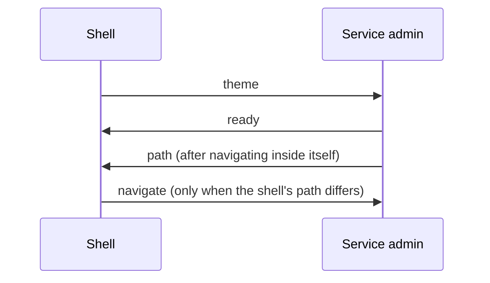

*[Documentation](README.md) → The admin panel*

# The admin panel

One panel at `/admin`, made of parts that belong to different services.

## What is in it

| Section | Belongs to | Holds |
| --- | --- | --- |
| **Auth** | the Auth service | sign-in addresses, their state, sessions, the security log |
| **Users** | the Users service | product profiles |
| **Notifications** | the Notifications service | the event log, read-only |
| **Email** | the Email service | templates, the editor, the delivery log |
| **Администраторы** | the panel itself | who may open it and what they may reach |
| **Журнал** | the panel itself | every change to administrator access |
| **База данных** | the panel itself | the database browser, owner-only |

The sidebar also links to the site and the application. They open in their own tab: they are the
product, not part of the panel.

## Two kinds of thing, and why the URLs say which

A **service admin** is one service's own window onto its own data, built and served by that service.
A **section** is the panel's own page.

Everything the panel embeds lives under `/admin/embed/`, and the panel's own pages are ordinary
paths:

| | |
| --- | --- |
| `/admin/service/email#/templates/123` | the panel's page, showing the Email admin |
| `/admin/embed/service/email/templates/123` | the Email admin itself, embedded |
| `/admin/database` | the panel's page, showing the database browser |
| `/admin/embed/database/` | the browser itself |
| `/admin/administrators`, `/admin/audit` | the panel's own sections |

Keeping the two apart is what lets every page be a path. It also means an embedded URL can be
opened directly — Gateway performs the very same check either way.

## How the shell and an embedded admin talk

The shell owns the sidebar, the theme and the URL. The embedded admin owns everything inside its
frame. They exchange four messages, all same-origin:

The rule that matters: **every frame load re-sends the theme and never the shell's path.** A load
can be the frame's own navigation, and replaying the path the shell still remembers would silently
cancel it. That failure is covered by a browser test, because nothing else would notice it.

An embedded admin also works standing alone at its own URL, and then it owns its theme and shows
its own switch. Inside the shell it hides that switch rather than offering a second, disagreeing
one.

## Adding a section to the panel

A section is a page of the Admin service's own shell: add a route in
[`main.tsx`](../modules/admin/web/src/main.tsx) and an entry in the sidebar. If only the owner
should see it, wrap it the way `/admin/administrators` is wrapped — and remember that the guard is
presentation, so the server has to refuse it too.

## Adding a service admin

Copy the closest existing one — `modules/auth/web` is the plainest — and change four things:

1. `web/vite.config.ts`: the `base`, which must match `/admin/embed/service/<id>/`;
2. `web/src/api.ts`: the prefix, the contract it is typed against, and which of its procedures
   change something and therefore carry a CSRF token;
3. `web/src/main.tsx`: the `basepath`, the tabs and the routes;
4. `package.json`: the build and typecheck scripts, and the build-time dependencies.

Then add the service to `ADMIN_SERVICE_IDS` in `contracts/`, to Gateway's allowlist, and to
[`services.ts`](../modules/admin/web/src/services.ts). `scripts/check-service-ids.mjs` refuses a
build where it appears in one of the three and not the others.

There is deliberately no generator. It would have to keep its own copy of the file list, the
dependency versions and the config templates, and would fall behind the admins it claims to
produce. Copying a directory that is known to work cannot.

## The interface it is built from

Each admin keeps **its own copy** of the shadcn components it uses, its own `components.json` and
its own design tokens. Nothing is shared at runtime, so a service can restyle or replace its admin
without touching another's, and no common component can break four screens at once.

The values are deliberately the same across them, and the database browser repeats them once more
in its own stylesheet. Three copies, no shared file: that is the price of the isolation above, and
it is paid knowingly.

## Related

- [Administrator access](admin-access.md) — who may open what, and why the database is owner-only.
- [Architecture](architecture.md) — where the panel sits among the services.
