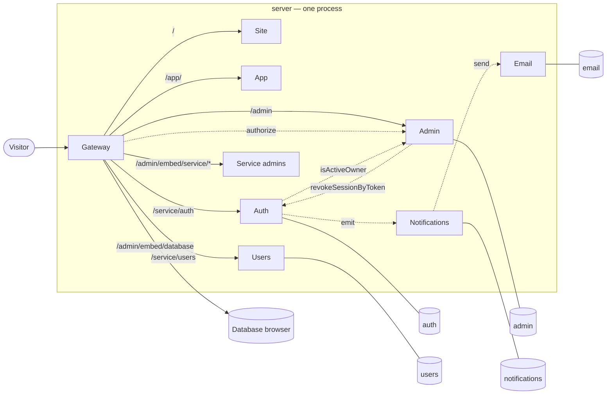

*[Documentation](README.md) → Architecture*

# Architecture

A modular monolith: eight modules in one process, each owning its own data and its own interface,
plus the database browser the admin panel embeds, which stays a container of its own.

Modules are still modules. Separate packages of the workspace, separate databases, talking to each
other through contracts and nothing else. What changed is where they run, not what they are allowed
to know about each other.

## The shape of it



Solid lines are requests arriving from outside; dotted lines are calls modules make to each other.
Both are the same thing now — a `Request` answered by a module's own application — and they still go
through the contracts, so what crosses a boundary is exactly what crossed it over the network.

Adminer is outside the box on purpose: it is the one target that is still a real address over a real
network.

## Two entry points, and they are not the same thing

After this move the words are close enough to be worth separating:

- the **entry of the program** is `composition/`. It starts first, reads the environment, opens the
  pools, builds every module, wires them together and listens;
- the **entry for traffic** is Gateway. The composer mounts it, and only it, on the public listener,
  so every request from outside reaches Gateway before it reaches anything else.

The Compose service is called `server` — the whole process. The module inside it that traffic enters
through is called `gateway`. Neither name is the other.

The composer is allowed to know every module, which makes it the widest permission in the
repository. It can afford that only while it contains no decisions at all — just the order of calls.
The moment it starts deciding something, that permission becomes the hole the decision is made
through.

## Why it is split this way

Each module owns one thing completely, including its database. Nothing reads another module's
tables — a module that did would break the moment the other changed a column, and there would be no
way to replace one of them without replacing both.

Sharing a process does not soften that. A module connects as a role of its own and `PUBLIC` has no
`CONNECT`, so a module handed a neighbour's database name is refused while connecting, before a
single statement runs. That is the only layer here that catches a query written against a
neighbour's table: to every check that reads code, SQL is a string and not a structure.

| Module | Owns | Deliberately does not know |
| --- | --- | --- |
| **gateway** | The public surface: routing, allowlists, the admin decision | Any business rule |
| **site** | Public pages | Anything about a signed-in person |
| **app** | The interface behind sign-in | Any data; it asks Auth and Users |
| **auth** | Identity, passwords, sessions, security events | Who is an administrator; product data |
| **users** | The product profile | Passwords, sessions, admin rights |
| **admin** | Who may open the panel and what they may reach | How anyone signs in |
| **notifications** | Typed events and where they go | How a message is written or sent |
| **email** | Templates, publishing, transports, the delivery log | Why a message was asked for |

The two that are easiest to confuse are Auth and Users. An identity is *how someone signs in*; a
profile is *who they are inside the product*. Keeping them apart is what lets a product change its
profile fields freely without touching anything that guards an account.

Admin is a third thing again: being an administrator is not a property of an identity, it is a
separate record. That is why deleting an administrator entry never touches the account.

## One way in

Gateway is the only application mounted on the public listener — locally reached by a single
published port, in production by the platform routing a domain to the process. Nothing else is
reachable from outside, including the database browser, which has no host port in any environment.

That is now a property of the wiring rather than of the network: the internal surfaces are not
mounted where a request from outside can arrive at them. A `/internal/rpc` request through Gateway
matches no route, falls through to the site and gets an ordinary 404 — there is an acceptance check
that keeps it that way.

Gateway decides three things and nothing else:

1. **Is this path public?** An explicit allowlist. A module not on it answers 404 from outside, no
   matter what it exposes internally.
2. **Which part of the panel is this, and may this person open it?** Gateway works out the target
   from the URL — the panel, one service's admin, or the database area — and asks Admin, every time,
   caching nothing. That is why a revoked grant takes effect on the very next request, and why
   Gateway holds no policy: it knows the shape of the URLs, not who is allowed.
3. **What does the module behind it get to know?** Gateway builds the `x-template-admin-*` headers
   itself after that decision, and strips whatever arrived with the request. A client cannot forge
   an administrator.

If Admin or Auth cannot be reached, the answer is a 503, not a guess. A gateway that failed open
would be worse than one that was down.

## The admin panel is composed, not merged

The central shell owns the sidebar, the theme and the URL. Each service admin is a separate build,
owned by its service, embedded as a same-origin iframe; the shell never imports their code. Hiding
a service in the sidebar is presentation, never protection — the embedded URL passes the same
Gateway check.

See [the admin panel](admin-panel.md) for what it contains, how the two sides talk, and how to add
to it.

## Contracts, not conventions

Modules talk over tRPC, and each declares the shape of every call it answers — a Zod schema on the
input and one on the output, written at the procedure itself.

What more than one module has to agree on lives in `shared/src/vocabulary.ts`: the primitives every
schema is built from, which services exist, what an administrator's role is. That file imports `zod`
and nothing else, and a check enforces it — browser bundles read it directly, and one import of the
server's toolbox would follow it into a page.

A module still may not import a neighbour's code — `scripts/check-boundaries.mjs` refuses a build
where one does — with a single exception it names explicitly: `@template/<neighbour>/contract`, and
that specifier only. The exception exists because a tRPC client is typed from the server's router,
so the type has to cross the boundary; the door is one `exports` key per module, resolving to a file
that re-exports router types and nothing else. `@template/auth` alone still resolves to `createApp`,
and `dist/repository.js` resolves to nothing at all.

That door is a projection of the implementation, not an agreement, and it is not what keeps a
router honest. Two things do, and both are ordinary TypeScript rather than machinery of ours.

Every procedure declares `.output()`, so a response that does not match the schema fails instead of
shipping. The tRPC documentation calls this optional — the client's type is inferred from the
resolver anyway — and it is optional right up until the resolver returns a row read from a
repository. Then the extra columns travel, and the compiler does not object, because excess property
checks apply to object literals and not to variables.

And every router is pinned to the names it is allowed to hold:

```ts
type PublicName = 'getOwnProfile' | 'updateOwnProfile';
export const publicRouter = publicT.router({ … } satisfies Record<PublicName, unknown>);
```

The constraint lands on the object literal, which is exactly where TypeScript does check for
properties that should not be there. What it buys is that a procedure cannot land on the wrong
surface unnoticed — an admin procedure written into a public router is a compile error rather than
an open endpoint.

They kept talking that way after moving into one process, and that was a decision rather than
inertia. A direct method call would be faster and would hide the two things that only ever show up
at a boundary — Zod coercing an input, a `Date` becoming a string through JSON — until the day a
module has to be moved back out into a service of its own. What the move actually removed is the
TCP hop, and nothing else: the composer hands each module's client the neighbour's own `app.fetch`.

One thing had to be rebuilt by hand. Over the network a client's `AbortSignal` bounds the wait; in
one process it is ignored, and a handler that hangs never returns at all — measured, a 1500 ms
handler under a 200 ms limit came back after 1512 ms with no error. So the deadline lives in
`createTrpcClient` now. It buys exactly one thing: the caller stops waiting. The handler runs to its
end regardless.

Each contract is split by who may call it:

- **public** — reachable through Gateway by anyone, session or not;
- **internal** — never routed by Gateway, so it is reachable only from inside the process;
- **admin** — through Gateway's admin route, after the role and grant were checked.

Notifications and Email have no public surface at all.

## Data

One PostgreSQL server, one database per module with state, named `<PROJECT_SLUG>_<module>`, owned by
a role of the same name. Nothing migrates another module's schema.

Migrations are a command — `migrate` — that runs to completion before the application starts, not
something the process does to itself on the way up. A failed migration then fails the deploy, with a
non-zero exit code and the name of the module that stopped it, instead of leaving a container in a
restart loop.

Credentials are handed to a module and never read by it. The composer reads the environment, opens
the five pools, gives each module the one that is its own, and then deletes the single-module secrets
from `process.env` — because in one process that variable is shared by everyone in it, and a
neighbour's credentials read out of it would connect as the owner, past the roles entirely.

In production the server is a managed resource of the deployment platform, reached through
`DATABASE_URL`. Locally it is a container in the same Compose project, so the whole thing has one
lifecycle.

## What this gave up

Isolation of failure, and it is worth naming rather than glossing. When every module was a container,
an out-of-memory kill or a rendering job that would not finish took down that container alone. In one
process it takes down everything, the public site included.

Two answers are kept ready. The first is that the one piece of CPU-bound work on the path — rendering
email templates — no longer runs on start-up at all; it belongs to the `migrate` command. The second
is the way out: `SERVICE_URL_<MODULE>` pointed at a real address, with the network `fetch` handed to
that module's client, moves a module back out into a service of its own without changing a line of
its code. The contracts are what make that possible, which is most of why the calls still go through
them.

## Further reading

- [The admin panel](admin-panel.md) — what it contains and how it is composed.
- [Administrator access](admin-access.md) — roles, grants and the first owner.
- [Local development](local-development.md) — running it, worktrees, checks.
- [Deployment](deployment.md) — what a deployment supplies and what it must not.
