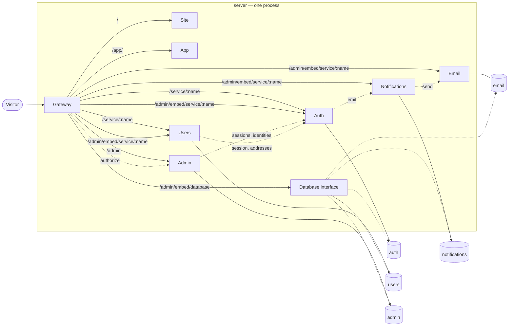

*[Documentation](README.md) → Architecture*

# Architecture

A modular monolith: eight modules in one process, each owning its own interface and — where it keeps
state — its own database. Nothing else runs beside them: the process is the whole application.

Modules are still modules. Separate packages of the workspace, and on the server they call each other
through `@template/<name>/contract` and nothing else — `check-boundaries` refuses a build where one
reaches for anything more. What changed is where they run, not what they are allowed to know about
each other.

## The shape of it



Solid lines are requests arriving from outside; dotted lines are calls modules make to each other,
and the two are no longer the same thing. A solid one is a `Request` Gateway forwards without
reading: it routes by path and rewrites nothing. A dotted one is a direct call on a caller the
neighbour handed out — no request, no JSON — and it still goes through the contract, because the
procedure validates its input and output by the same schemas and answers under the same deadline as
when the call was carried as a request. The only such call Gateway itself makes is `authorize`.

A dotted label names the procedure where there is only one of them, and the subject where there are
several — the callee's own README lists which procedures each neighbour calls.

There is no box outside the process any more: the third-party console this project used to embed, the
one target reached over a real network, is gone. What answers the database section now is
[`pg-interface`](../pg-interface/README.md), a package of ours — and the one thing in the process that
looks at all five databases, which is why the owner alone reaches it. It opens its own small pools
rather than borrowing the modules', so a heavy query typed into it cannot hold a connection a request
needs; that is what the dotted lines from it mean.

## Two entry points, and they are not the same thing

After this move the words are close enough to be worth separating:

- the **entry of the program** is [`index.ts`](../index.ts) at the root. It starts first, reads the
  environment, builds every module, hands each its own environment and a way to reach its neighbours,
  and listens;
- the **entry for traffic** is Gateway. The composer mounts it, and only it, on the public listener,
  so every request from outside reaches Gateway before it reaches anything else.

The program is one process. The module inside it that traffic enters through is called `gateway`, and
that name belongs to the module, not to the program.

That entry is allowed to import every package, which makes it the widest permission in the
repository — granted to the file by name in `scripts/workspace-rules.mjs`, not to the root directory,
so a folder nobody has written a rule for does not inherit it. It can afford the permission only while
the wiring holds no decisions — just the order of calls. The moment one moves in, that permission
becomes the hole the decision is made through.

## Why it is split this way

Each module owns one thing completely, including the database it keeps that thing in, where it has
one. Nothing reads another module's tables — a module that did would break the moment the other
changed a column, and there would be no way to replace one of them without replacing both.

Sharing a process does not soften that, and the databases stay separate: a query cannot reach a
neighbour's table, because that would take a different connection and not a different table name.

What it does soften, deliberately, is who enforces it. There are no per-module roles: a module creates
its own database on first use, which needs an account allowed to create databases, and such an account
opens every database on the server. So the module that opens the wrong one is stopped by the check it
makes when its pool opens — the name it landed on against the name it was told to expect — and by
nothing in PostgreSQL. The check runs before the migrations, which is what keeps a mistyped
`DATABASE_URL_<MODULE>` from building one module's tables in another's database.

| Module | Owns | Deliberately does not know |
| --- | --- | --- |
| **gateway** | The public surface: routing, allowlists, enforcing the admin decision | Any business rule, and who is allowed — it asks Admin |
| **site** | Public pages | Anything about a signed-in person |
| **app** | The interface behind sign-in | Any data; its pages ask Auth and Users |
| **auth** | Identity, passwords, sessions, security events | Who is an administrator, and it no longer asks: the rule that needed the answer lives in Admin. Product data |
| **users** | The product profile | Passwords, sessions, admin rights |
| **admin** | Who may open the panel and what they may reach | How anyone signs in |
| **notifications** | Typed events and where they go | How a message is written or sent |
| **email** | Templates, publishing, transports, the delivery log | Why a message was asked for |

The two that are easiest to confuse are Auth and Users. An identity is *how someone signs in*; a
profile is *who they are inside the product*. Keeping them apart is what lets a product change its
profile fields freely without touching anything that guards an account.

Admin is a third thing again: being an administrator is not a property of an identity, it is a
separate record. That is why disabling an administrator, which is what the registry offers instead of
a delete, never touches the account.

## One way in

Gateway is the only application mounted on the public listener, and the process opens exactly one
port: `@hono/node-server` — the import that opens one — may be written in the entry and nowhere else,
which `check-boundaries` enforces. Nothing else is reachable from outside, the database interface
included: it has no listener of its own at all, only the section Gateway routes to it.

That is now a property of the wiring rather than of the network, and it went one step further: an
internal surface is not mounted on a path at all. A neighbour reaches those procedures through a
caller, so there is nothing for a request to arrive at. A `/internal/rpc` request through Gateway
matches no route, falls through to the site and gets an ordinary 404 — there is an acceptance check
that keeps it that way.

Gateway decides three things and nothing else:

1. **Is this path public?** An explicit allowlist. A module not on it answers 404 from outside, no
   matter what it exposes internally.
2. **Which part of the panel is this, and may this person open it?** Gateway works out the target
   from the URL — the panel, one service's admin, or the database area — and asks Admin, every time,
   caching nothing. That is why a revoked grant takes effect on the very next request, and why
   Gateway holds no policy: it knows the shape of the URLs, not who is allowed.
3. **What does the module behind it get to know?** Gateway builds the `x-template-admin-*` headers
   itself after that decision, and strips whatever arrived with the request. A client cannot forge
   an administrator.

If Admin or Auth cannot be reached, the answer is a 503, not a guess. A gateway that failed open
would be worse than one that was down.

## The admin panel is composed, not merged

The central shell owns the sidebar, the theme and the URL. Each service admin is a separate build,
owned by its service, embedded as a same-origin iframe; the shell never imports their code. Hiding
a service in the sidebar is presentation, never protection — the embedded URL passes the same
Gateway check.

See [the admin panel](admin-panel.md) for what it contains, how the two sides talk, and how to add
to it.

## Contracts, not conventions

Modules talk over tRPC, and each declares the shape of every call it answers — a Zod schema on the
input and one on the output, written at the procedure itself.

What more than one module has to agree on lives in `shared/src/vocabulary.ts`: the primitives every
schema is built from, which services exist, what an administrator's role is. That file imports `zod`
and nothing else, and a check enforces it — browser bundles read it directly, and one import of the
server's toolbox would follow it into a page.

A module still may not import a neighbour's code — `scripts/check-boundaries.mjs` refuses a build
where one does — with a single exception it names explicitly: `@template/<neighbour>/contract`, and
that specifier only. The exception exists because a neighbour is typed from the caller a module hands
out, and a browser bundle from the router behind its own admin screen; either way the type has to
cross the boundary. The door is one `exports` key — `./contract`, on each of the five modules a
neighbour has to see into — resolving to a file that carries types and nothing but types: the caller
type, the router types a browser needs, and the shapes inferred from that module's schemas. The bare
`@template/auth` resolves to `createModule` and its own environment type, and `dist/repository.js`
resolves to nothing at all.

That door is a projection of the implementation, not an agreement, and it is not what keeps a
router honest. Two things do, and both are ordinary TypeScript rather than machinery of ours.

Every procedure declares `.output()`, so a response that does not match the schema fails instead of
shipping. The tRPC documentation calls this optional — the client's type is inferred from the
resolver anyway — and it is optional right up until the resolver returns a row read from a
repository. Then the extra columns travel, and the compiler does not object, because excess property
checks apply to object literals and not to variables.

And every router is pinned to the names it is allowed to hold:

```ts
type PublicName = 'getOwnProfile' | 'updateOwnProfile';
export const publicRouter = publicT.router({ … } satisfies Record<PublicName, unknown>);
```

The constraint lands on the object literal, which is exactly where TypeScript does check for
properties that should not be there. What it buys is that a procedure cannot land on the wrong
surface unnoticed — an admin procedure written into a public router is a compile error rather than
an open endpoint.

When the modules were separate services they talked over HTTP, and for a while after moving into one
process they kept doing exactly that — the composer handed each module's client the neighbour's own
`app.fetch`, so the only thing the move had removed was the TCP hop. That is finished: a module now
hands its neighbour a **caller** built from its own router, and the neighbour invokes a procedure as
a method. The boundary is unchanged in what it checks — the input schema, the output schema and the
middleware all run exactly as before — and the caller is built per request, so the request id still
travels with the call.

What that gave up is the last of the network's habits: nothing is serialized on the way, so a `Date`
stays a `Date` where a JSON hop would have made it a string. A strict schema refuses a live object
anyway; a field declared `z.any()` or `z.date()` would not.

The deadline had to be rebuilt by hand and stayed rebuilt. Over the network a client's `AbortSignal`
bounds the wait; in one process it is ignored, and a handler that hangs never returns at all —
measured, a 1500 ms handler under a 200 ms limit came back after 1512 ms with no error. So the module
that hands out the caller puts the deadline on it, with `withDeadlineOn`, and no call site has to
remember. It buys exactly one thing: the caller stops waiting. The handler runs to its end
regardless.

Each contract is split by who may call it:

- **public** — reachable through Gateway by anyone, session or not;
- **internal** — not mounted on a path at all, and reached only through the caller the module
  hands out;
- **admin** — through Gateway's admin route, after the role and grant were checked.

Notifications and Email have no public surface at all.

## Data

One PostgreSQL server, one database per module with state, named `<PROJECT_SLUG>_<module>`. Nothing
migrates another module's schema, and nothing but a module touches its own — with one door, opened
deliberately: the panel's database section can add a column, and rename or drop a column it added
itself. It keeps a journal of that in the database it changed, and it will not touch a column a
migration created. See [`pg-interface`](../pg-interface/README.md).

A module prepares its own storage, on the first request that needs it: create the database if it is
missing, apply the migrations, check what was opened, keep the pool. There is no deployment step in
front of it. The cost is explicit — a broken migration answers 500 instead of failing a deploy — and
the reason is that a module owning its data owns bringing it into existence too.

Credentials are handed to a module and never read by it: the composer reads the environment and gives
each module the connection string of its own database and the name it must land on. What is in the
environment is `DATABASE_URL` — one account, which owns the server and opens every database on it — and
it stays there. Deleting it after handing it out was tried and dropped: the string lives on `c.env` for
the life of the process anyway, so the deletion bought a reader that remembered every name it read and
little else.

In production the server is a managed resource, reached through `DATABASE_URL`. Locally it is a
PostgreSQL on the machine, one server for every copy of the project — what keeps two copies apart is
the slug in the database names, not the server.

## What this gave up

Isolation of failure, and it is worth naming rather than glossing. When every module was a service of
its own, an out-of-memory kill or a rendering job that would not finish took that one down alone. In
one process it takes down everything, the public site included.

Two answers are kept ready. The first is that the CPU-bound work is off the start-up path: rendering
the seed email templates happens once per fresh database, on the first request that reaches Email, and
never again on a restart.
Rendering has not left the process — publishing a template, previewing a version and a test send all
call `@maily-to/render` on an admin request — but those are an administrator's own actions, not
something a visitor or a restart can trigger. The second is that a module stays a package of its own:
what it offers is a contract and what it needs is handed to it, so putting one behind a real network
again is work in `shared` and in the composer, not in the module. It is not a switch, and nothing here
is written on the assumption that it will happen.

**And transactions across a module boundary**, which follows from one database per module. A
transaction lives in one connection to one database and no module can open a neighbour's, so two
modules changing something together is two calls, and the second can fail after the first has
committed. Foreign keys go the same way: `profiles.identity_id` and `administrators.user_id` both
name an Auth identity and neither is one. What the template does instead is make the second step safe
to repeat — Notifications and Email each deduplicate by a key of their own, so the same hand-off
arriving twice sends one message. What it has no answer for is a hand-off that fails: the event stays
`failed`, and the admin surface of Notifications is read-only. A project that needs a retry adds one.

## Further reading

- [The admin panel](admin-panel.md) — what it contains and how it is composed.
- [Administrator access](admin-access.md) — roles, grants and the first owner.
- [Local development](local-development.md) — running it, worktrees, checks.
- [Deployment](deployment.md) — what a deployment supplies and what it must not.
